# 🏫 Sistem Data Siswa

Sistem informasi manajemen data siswa dan guru berbasis web yang dirancang untuk membantu pengelolaan data akademik sekolah secara terstruktur dan efisien.

Aplikasi ini dikembangkan menggunakan **PHP Native**, **MySQL**, **HTML**, **CSS**, dan **JavaScript** dengan sistem multi-role untuk mendukung kebutuhan administrasi sekolah.

---

# 📖 Deskripsi

Sistem Data Siswa merupakan aplikasi yang digunakan untuk mengelola data siswa, data guru, tahun ajaran, serta pembuatan laporan dengan akses yang disesuaikan berdasarkan peran pengguna.

Sistem ini dirancang agar proses administrasi sekolah menjadi lebih cepat, rapi, dan mudah dipantau oleh pihak terkait.

---

# 👥 User Roles

## 🗂️ Admin TU
- Mengelola data siswa
- Mengelola data guru
- Mengelola tahun ajaran
- Mengakses laporan
- Mengelola data sistem

## 📊 Operator Dapodik
- Mengelola dan memverifikasi data siswa
- Mengelola data guru
- Monitoring data akademik

## 👨‍💼 Kepala Sekolah
- Monitoring seluruh data sekolah
- Melihat laporan
- Monitoring statistik data

## 👨‍🏫 Wakil Kepala Sekolah
- Monitoring data siswa
- Monitoring data guru
- Monitoring laporan akademik

---

# ✨ Features

## Authentication System
- Login multi-role
- Session management
- Role-based access control
- Secure authentication

## Student Management
- Tambah data siswa
- Edit data siswa
- Hapus data siswa
- Detail data siswa

## Teacher Management
- Tambah data guru
- Edit data guru
- Hapus data guru
- Detail data guru

## Academic Year Management
- Kelola tahun ajaran
- Aktivasi tahun ajaran berjalan

## Reporting System
- Rekap data siswa
- Rekap data guru
- Laporan sistem

## Dashboard Analytics
- Dashboard Admin TU
- Dashboard Dapodik
- Dashboard Kepala Sekolah
- Dashboard Wakil Kepala Sekolah

---

# 🛠️ Technology Stack

## Backend
- PHP Native

## Database
- MySQL

## Frontend
- HTML5
- CSS3
- JavaScript

## Development Tools
- XAMPP
- Git
- GitHub

---

# 📂 Project Structure

```bash
sistem-data-siswa
│
├── abu-data/
│   │
│   ├── admin_tu/
│   ├── dapodik/
│   ├── kepsek/
│   ├── wakil_kepsek/
│   │
│   ├── auth/
│   ├── config/
│   ├── includes/
│   ├── assets/
│   ├── uploads/
│   ├── foto/
│   ├── tahun-ajaran/
│   │
│   └── index.php
│
├── docs/
│   ├── landing-page.png
│   ├── login-form.png
│   ├── admin-dashboard.png
│   ├── dapodik-dashboard.png
│   ├── kepsek-dashboard.png
│   ├── wakil-dashboard.png
│   ├── data-siswa.png
│   ├── data-guru.png
│   ├── tahun-ajaran.png
│   └── laporan.png
│
├── erd.png
├── usecase.png
├── struktur_file.txt
├── data_sql_mysql.txt
└── README.md
```

---

# 🖼️ System Preview

## Landing Page

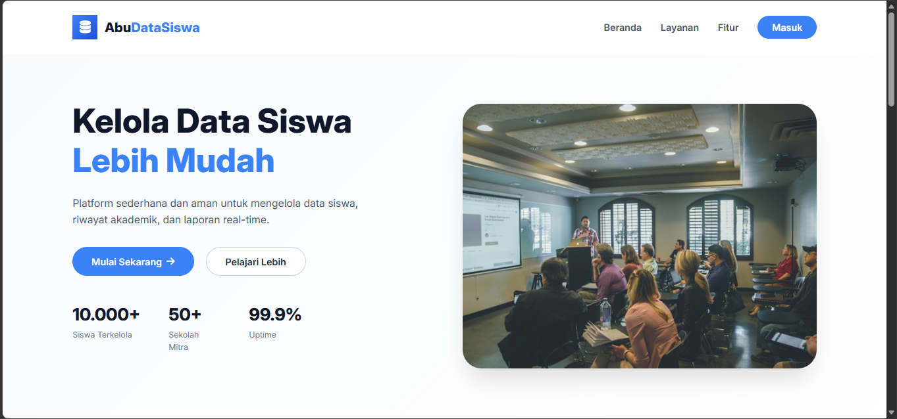

---

## Login Page

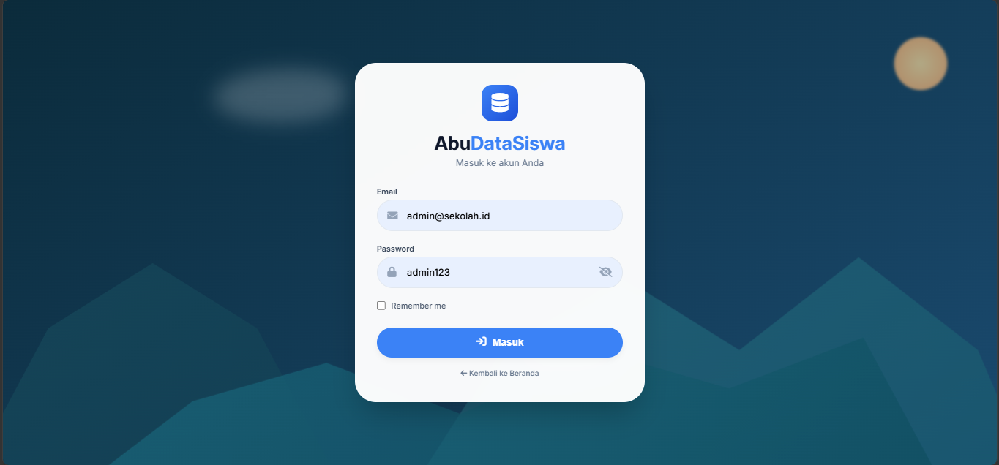

---

## Dashboard Admin TU

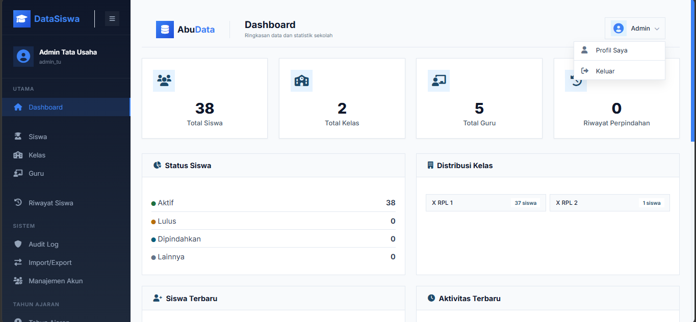

---

## Dashboard Dapodik

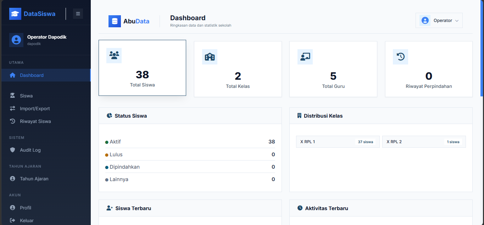

---

## Dashboard Kepala Sekolah

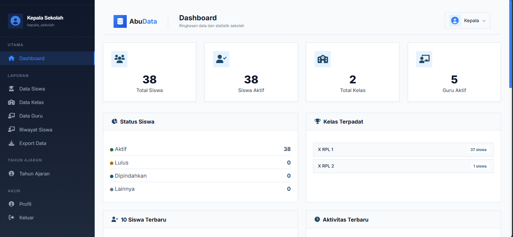

---

## Dashboard Wakil Kepala Sekolah

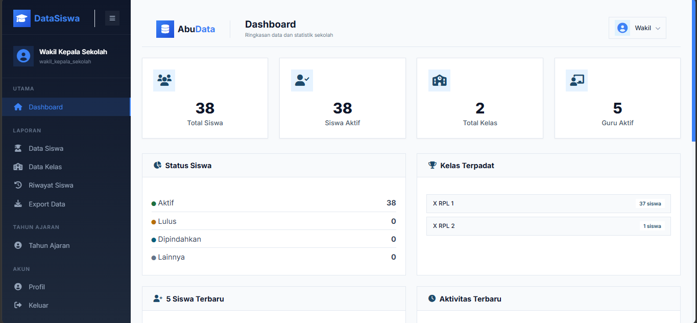

---

## Data Guru

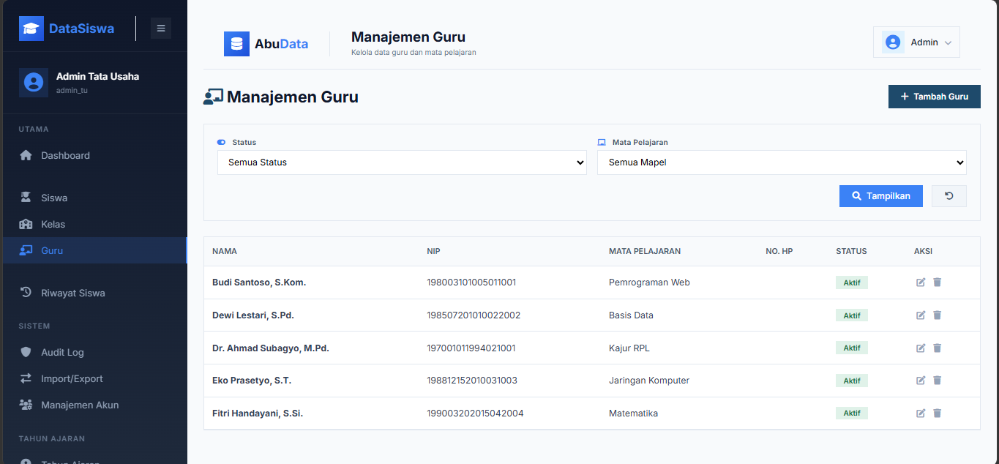

---

## Data Siswa

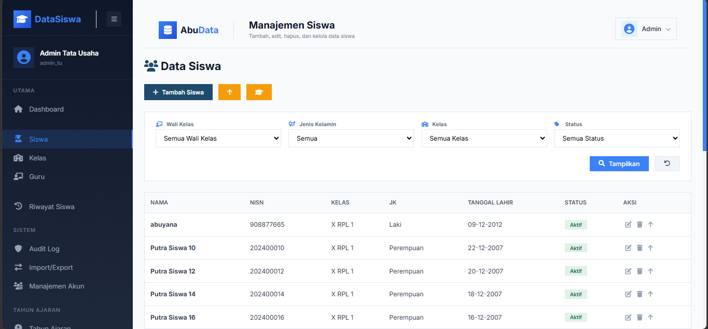

---

## Tahun Ajaran

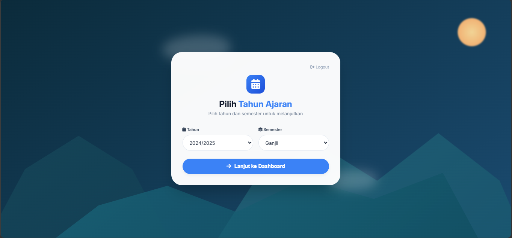

---

## Laporan

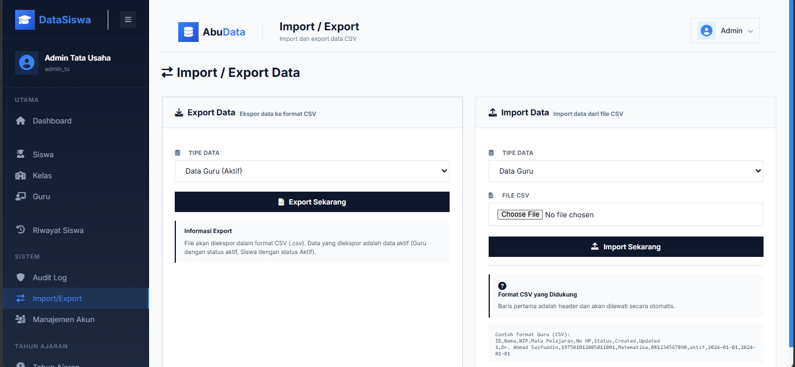

---

# 📊 System Design

## Use Case Diagram

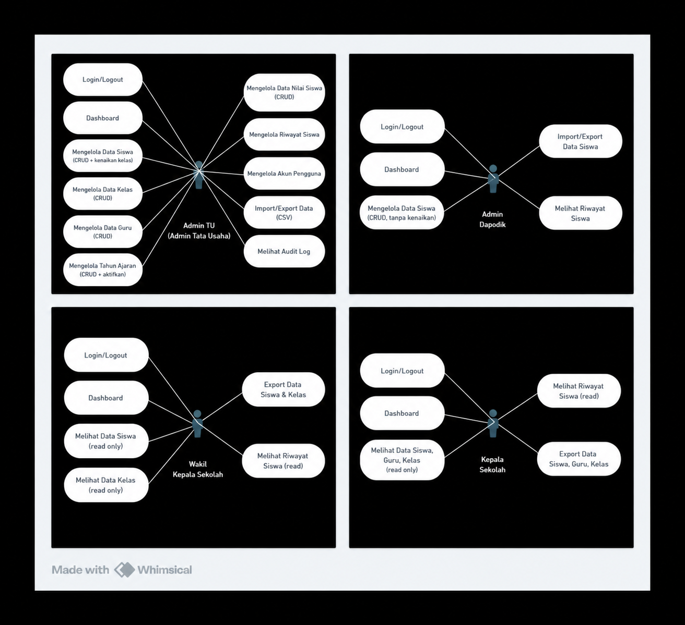

---

## Entity Relationship Diagram (ERD)

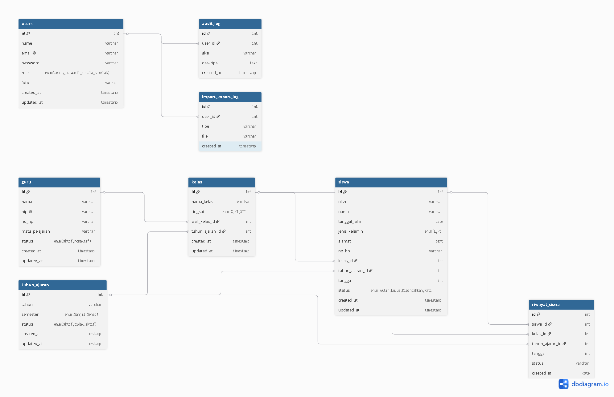

---

# 🚀 Installation

## Clone Repository

```bash
git clone https://github.com/Raffahmii/sistem-data-siswa.git
```

## Move Project

Pindahkan folder project ke:

```bash
xampp/htdocs/
```

Contoh:

```bash
xampp/htdocs/abu-data
```

---

## Import Database

Import file database:

```bash
data_sql_mysql.txt
```

ke phpMyAdmin.

---

## Configure Database

Edit file:

```php
config/database.php
```

atau file konfigurasi database yang digunakan.

Sesuaikan dengan konfigurasi lokal:

```php
$host = "localhost";
$user = "root";
$password = "";
$database = "abu_datasiswa";
```

---

## Run Application

Aktifkan:

- Apache
- MySQL

Kemudian buka:

```bash
http://localhost/abu_data/
```

atau sesuai nama folder project pada XAMPP.

---

# 📚 Learning Outcomes

Project ini dikembangkan untuk mempelajari:

- PHP Native Development
- Database Design
- Authentication System
- Session Management
- CRUD Operations
- Multi Role Access Control
- School Information System
- System Analysis & Design
- Software Documentation

---

# 🎯 Project Highlights

- Multi-role School Management System
- 4 User Roles
- Student Management Module
- Teacher Management Module
- Academic Year Management
- Reporting System
- Dashboard Monitoring
- ERD & Use Case Documentation

---

# 👨‍💻 Developer

**M. Raffa Izzel H**

Student Developer | Data Analyst Enthusiast | Web Developer

GitHub:
https://github.com/Raffahmii

---

# 📄 Notes

Project ini dibuat sebagai bagian dari pembelajaran pengembangan sistem informasi sekolah dan implementasi aplikasi manajemen data akademik berbasis web menggunakan PHP Native dan MySQL.
